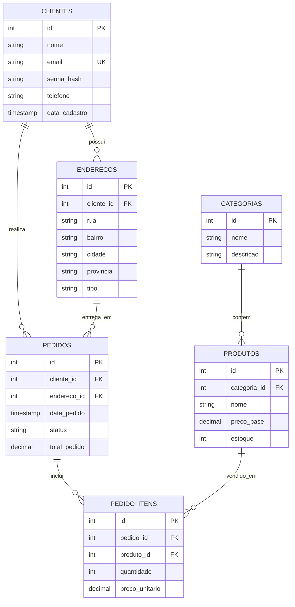

# Diagramas do Banco Blindado (Evolução 3NF)

## 1. Modelo Entidade-Relacionamento (ER)

O diagrama abaixo representa a estrutura profissional de e-commerce implementada em 3NF.

## 2. Justificativa da Normalização

- **1ª Forma Normal (1FN):** Atributos compostos como "Endereço" foram decompostos em campos atômicos (Rua, Cidade, Província).
- **2ª Forma Normal (2FN):** Todos os campos não-chave dependem totalmente da Chave Primária (ex: dados do produto não estão na tabela de itens, apenas o FK).
- **3ª Forma Normal (3NF):** Eliminamos dependências transitivas. O endereço de entrega é uma referência (FK), evitando repetir dados geográficos em cada pedido.
